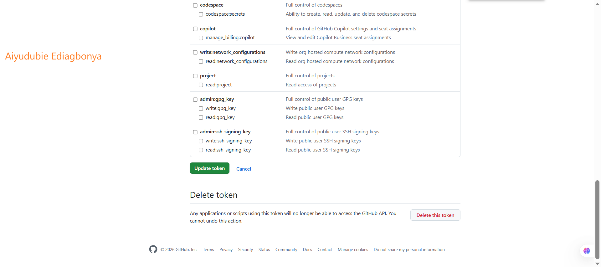
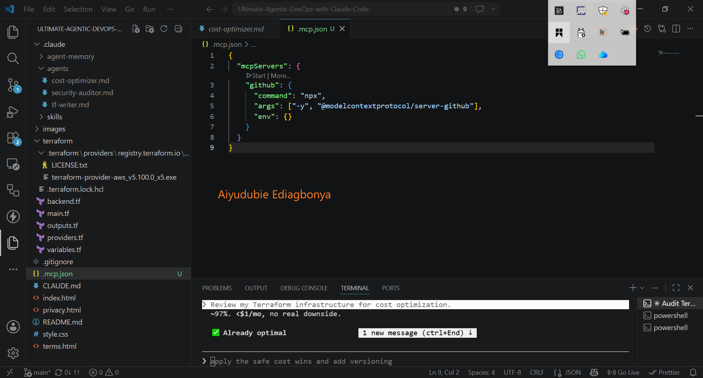
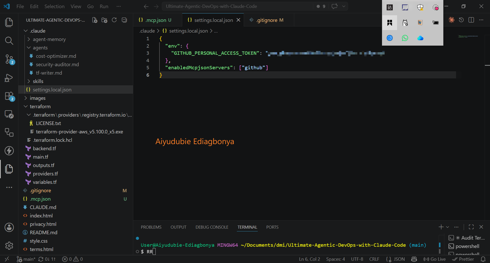
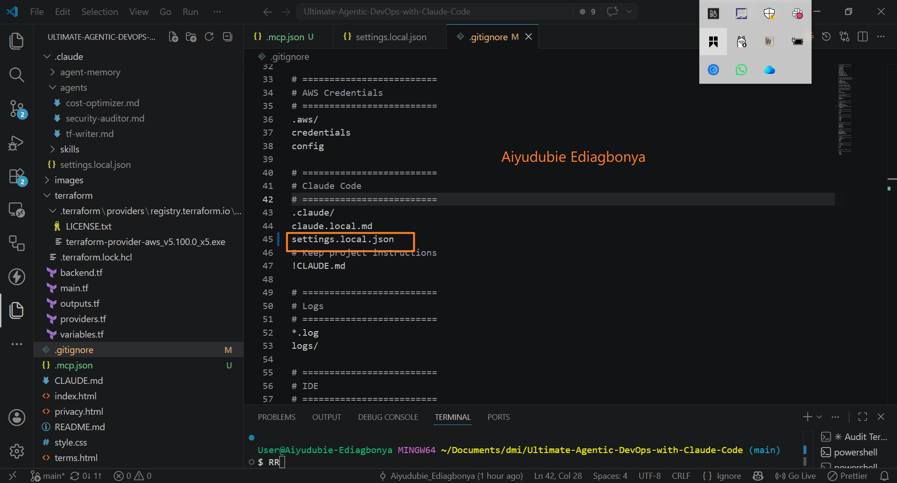
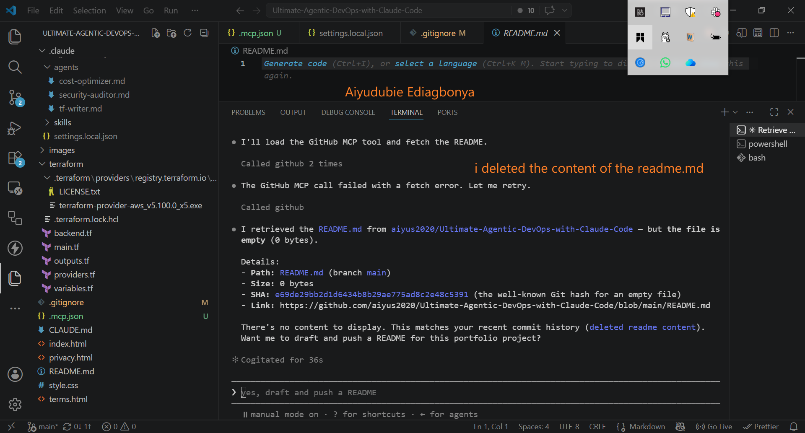

# Assignment 5 — Connecting Claude to the Outside World

Part of the DevOps Micro Internship (DMI) Cohort 3 with Agentic AI

---

## Purpose

In this assignment, you will connect Claude Code to external systems using MCP (Model Context Protocol). You will configure the GitHub MCP server, securely store credentials, verify the connection, and run a live query that proves Claude is accessing real-time GitHub data.

---

# Task 1 — Create a GitHub Personal Access Token

## Goal

Generate a GitHub Personal Access Token (PAT) that will be used for MCP authentication.

### Evidence

#### Screenshot 1 — GitHub token creation page showing the selected scopes (`repo`, `read:user`) — token value must NOT be visible

---

# Task 2 — Create .mcp.json at the Project Root

## Goal

Create and configure the `.mcp.json` file to define the GitHub MCP server.

### Evidence

#### Screenshot 2 — `.mcp.json` open in VS Code showing the full configuration

---

# Task 3 — Add Your Token to settings.local.json

## Goal

Store your GitHub token securely in `.claude/settings.local.json` and ensure it is not committed to version control.

### Evidence

#### Screenshot 3 — `settings.local.json` open in VS Code showing the `env` section — **blur or cover the actual GitHub token value**

---

# Task 4 — Verify the Connection with /mcp

## Goal

Confirm that the GitHub MCP server is successfully connected inside Claude Code.

### Evidence

#### Screenshot 4 — `/mcp` output showing `github: connected`

---

# Task 5 — Run a Live GitHub Query

## Goal

Verify MCP functionality by retrieving real-time data from your GitHub account using Claude Code.

### Evidence

#### Screenshot 5 — Claude's response showing the GitHub MCP tool call and the retrieved README.md content.

---

# Submission Instructions

- Ensure `.mcp.json` is committed to your GitHub repository
- Ensure `.claude/settings.local.json` is NOT committed (must be gitignored)
- Confirm token value is hidden in all screenshots
- Add all required screenshots to your submission
- Push final changes to your forked repository

---

## GitHub Repository URL

Paste your forked repository URL here:

`https://github.com/aiyus2020/Ultimate-Agentic-DevOps-with-Claude-Code.git`

---

## Security Confirmation

Confirm below:

- [ yes] `settings.local.json` is added to `.gitignore`
- [yes ] GitHub token is NOT exposed in repository or screenshots

---

# Completion Checklist

- [ yes] GitHub PAT created with correct scopes (`repo`, `read:user`)
- [ yes] `.mcp.json` created at project root
- [ yes] `.claude/settings.local.json` contains token (hidden in screenshot)
- [ yes] `.claude/settings.local.json` is NOT committed
- [ yes] `/mcp` shows GitHub connection as active
- [ yes] Live GitHub query returns real repository data
- [yes ] All required screenshots added
- [yes ] GitHub repository URL included

---

## 📌 About DMI & CloudAdvisory

DevOps Micro Internship (DMI) is a project-based DevOps program run by Pravin Mishra (The CloudAdvisory) focused on real-world execution, systems thinking, and career readiness.

It helps learners build strong DevOps foundations with hands-on experience.

---

## 📌 Resources

- 🌐 DMI Official Website: https://pravinmishra.com/dmi  
- 🎓 DevOps for Beginners (Udemy): https://www.udemy.com/course/devops-for-beginners-docker-k8s-cloud-cicd-4-projects/  
- 🎓 Agentic AI DevOps with Claude Code: https://www.udemy.com/course/ultimate-agentic-ai-devops-with-claude-code/  
- 🎓 DevOps with Claude Code: Terraform, EKS, ArgoCD & Helm: https://www.udemy.com/course/devops-with-claude-code-terraform-eks-argocd-helm/  
- ▶️ YouTube Playlist: https://www.youtube.com/playlist?list=PLFeSNDtI4Cho  
- 🔗 Pravin Mishra (LinkedIn): https://www.linkedin.com/in/pravin-mishra-aws-trainer/  
- 🏢 CloudAdvisory (LinkedIn): https://www.linkedin.com/company/thecloudadvisory/

---

*This submission is part of DevOps Micro Internship (DMI) Cohort 3 — Agentic AI Track.*